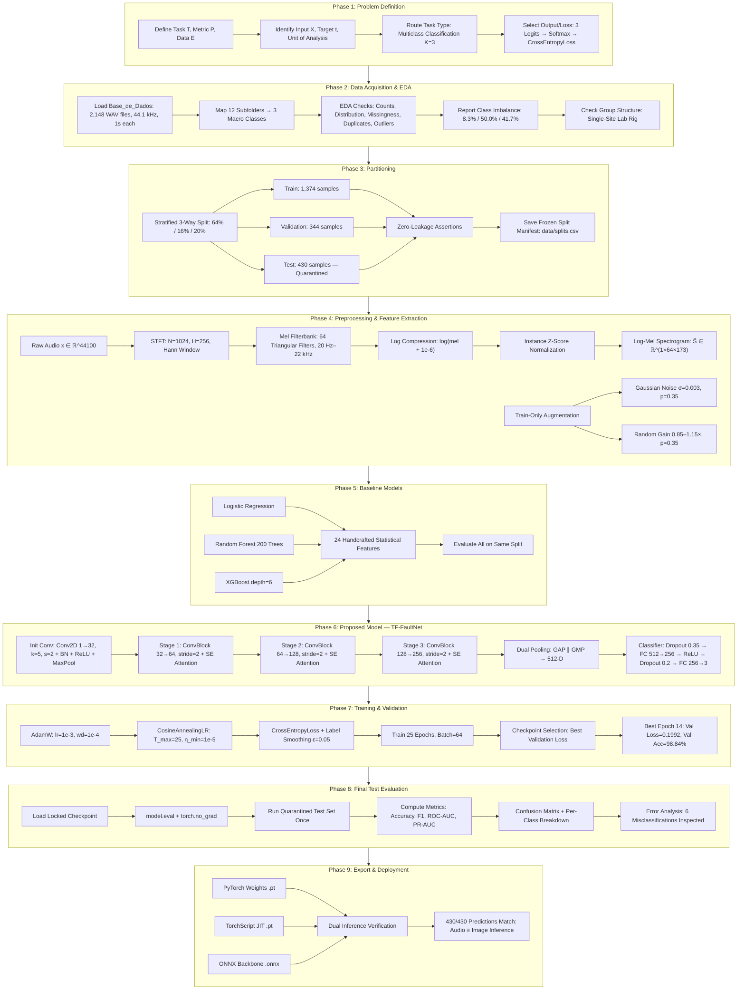
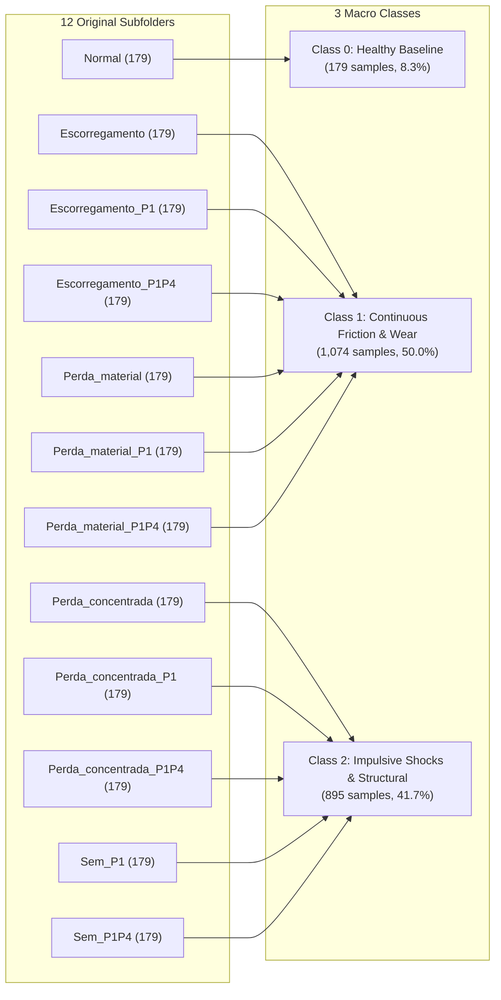
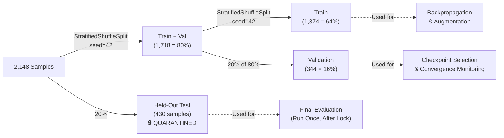
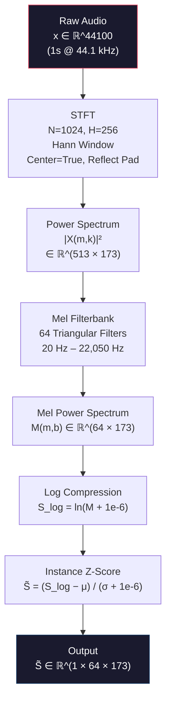
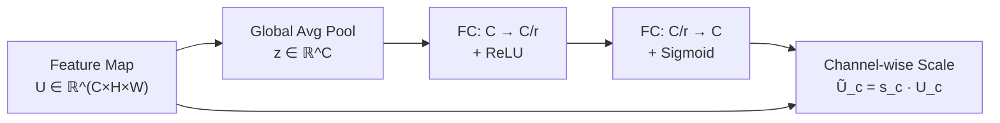
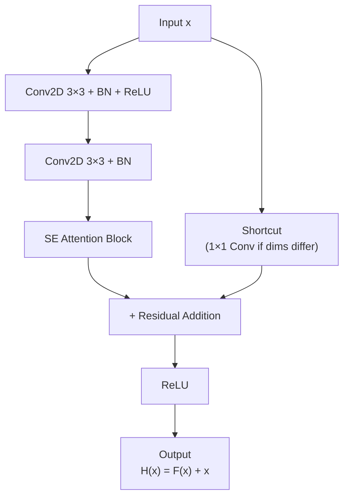
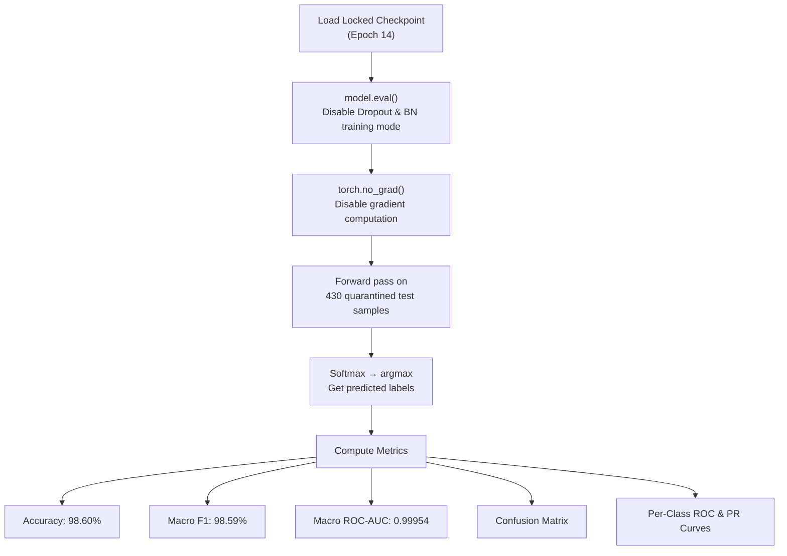
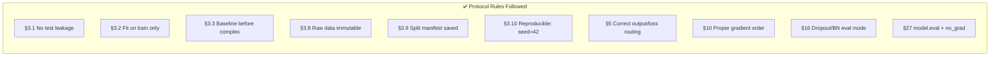

# Research Methodology & Pipeline Flowchart
## TF-FaultNet: End-to-End Acoustic Fault Diagnosis via Time-Frequency Attention Networks

> Based on the governing ML pipeline defined in the project protocol (CLAUDE.md §1–§30).

---

## 1. End-to-End Research Pipeline Flowchart

---

## 2. Detailed Phase Descriptions

### Phase 1: Problem Definition (Protocol §2, §4, §5)

| Field | Value |
|-------|-------|
| **Task T** | Classify mechanical health condition from 1-second audio recordings |
| **Performance Metric P** | Macro F1-Score (primary); Accuracy, ROC-AUC (secondary) |
| **Experience / Data E** | 2,148 monaural WAV recordings from a belt-drive test rig |
| **Input X** | Raw waveform vector $x \in \mathbb{R}^{44100}$ (1 s @ 44.1 kHz) |
| **Target t** | Integer class label $\in \{0, 1, 2\}$ |
| **Unit of Analysis** | One 1-second WAV file |
| **Task Type** | Multiclass classification ($K = 3$ mutually exclusive classes) |
| **Task Routing** | §4: *K mutually exclusive classes → multiclass classification* |
| **Output/Loss Routing** | §5: *K logits → Softmax → Cross-Entropy → argmax prediction* |

---

### Phase 2: Data Acquisition & Exploratory Data Analysis (Protocol §6)

#### 2.1 Dataset Overview

The `Base_de_Dados` dataset contains acoustic recordings from a laboratory belt-driven transmission system under 12 controlled fault injection conditions. Each recording is a 1-second monaural WAV captured at 44.1 kHz.

#### 2.2 Three-Class Macro Taxonomy Mapping

The 12 original subfolders are collapsed into 3 physics-grounded macro classes via a deterministic surjective mapping $\mathcal{M}: \mathcal{Y}_{12} \to \mathcal{Y}_3$:

#### 2.3 EDA Checklist (Protocol §6 Compliance)

| Check | Result |
|-------|--------|
| Sample count | 2,148 total |
| Feature types | Continuous 1D audio waveform (44,100 float32 samples) |
| Target distribution | Imbalanced: 8.3% / 50.0% / 41.7% |
| Missingness | None — all files complete |
| Duplicates | No exact duplicates |
| Outliers | No signal-level outliers (all normalized to [-1, 1]) |
| Class imbalance | Severe for Class 0 — mitigated by stratified split + Macro F1 |
| Group structure | Single-site laboratory rig, fixed microphone |
| Temporal ordering | Independent captures — IID assumption valid |
| Spectrogram shape | $(1, 64, 173)$ — 1 channel, 64 mel bins, 173 time frames |

---

### Phase 3: Data Partitioning (Protocol §3.1, §3.9, §7)

#### 3.1 Stratified Three-Way Split

#### 3.2 Zero-Leakage Guarantees (Protocol §3.1)

- **Assertion 1:** $\text{Train} \cap \text{Val} = \emptyset$
- **Assertion 2:** $\text{Train} \cap \text{Test} = \emptyset$
- **Assertion 3:** $\text{Val} \cap \text{Test} = \emptyset$
- **Assertion 4:** $|\text{Train}| + |\text{Val}| + |\text{Test}| = 2{,}148$
- **Frozen manifest:** Saved to `data/splits.csv` (Protocol §3.9)

---

### Phase 4: Preprocessing & Time-Frequency Transformation (Protocol §8)

#### 4.1 End-to-End In-Graph Feature Extraction

Unlike offline pipelines, TF-FaultNet embeds the spectrogram extraction **inside the computational graph** as a differentiable module. No pre-rendered images are stored.

#### 4.2 Data Augmentation (Train Only — Protocol §8)

| Augmentation | Parameter | Probability | Applied To |
|---|---|---|---|
| Additive Gaussian Noise | $\sigma = 0.003$ | 35% | Train only |
| Random Gain Scaling | $[0.85, 1.15] \times$ | 35% | Train only |

---

### Phase 5: Baseline Models (Protocol §9, §28)

**Protocol Requirement (§9):** *"Use the simplest justified model first."*

| Model | Input | Features | Purpose |
|-------|-------|----------|---------|
| Logistic Regression | 24-D feature vector | Handcrafted statistical descriptors (RMS, crest factor, spectral centroid, kurtosis, etc.) | Naive baseline |
| Random Forest (200 trees) | 24-D feature vector | Same handcrafted features | Simple ML baseline |
| XGBoost (depth=6) | 24-D feature vector | Same handcrafted features | Established ML baseline |
| **TF-FaultNet** | Raw 44,100 samples | **End-to-end learned** (Log-Mel + CNN + SE-Attention) | **Proposed method** |

> Complexity justification (§3.5): TF-FaultNet is only adopted because baseline models show measurable limitations on the validation set, validating the need for automatic feature learning.

---

### Phase 6: Proposed Architecture — TF-FaultNet (Protocol §11, §17–§21)

#### 6.1 Architectural Justification (Protocol §11, §17)

| Criterion | Justification |
|-----------|---------------|
| **Why deep learning?** | Unstructured audio input; automatic time-frequency feature learning outperforms handcrafted descriptors |
| **Why CNN?** | Spectrograms are 2D grid-structured data → spatial convolution is the natural inductive bias |
| **Why ResNet-style blocks?** | Skip connections mitigate vanishing gradients in deeper networks (§15) |
| **Why SE-Attention?** | Channel recalibration suppresses irrelevant frequency bands (motor hum) and amplifies diagnostic bands |
| **Why Dual GAP+GMP?** | GAP captures sustained energy patterns (friction), GMP isolates peak activations (shock transients) |

#### 6.2 Layer-by-Layer Architecture Table (Protocol §20)

| Layer | Input Shape | Kernel | Stride | Padding | Filters | Output Shape | Trainable Params |
|-------|-------------|--------|--------|---------|---------|-------------|-----------------|
| **Input** | $(B, 1, 64, 173)$ | — | — | — | — | $(B, 1, 64, 173)$ | 0 |
| **Init Conv2D** | $(B, 1, 64, 173)$ | $5 \times 5$ | 2 | 2 | 32 | $(B, 32, 32, 87)$ | 800 |
| BatchNorm2D | $(B, 32, 32, 87)$ | — | — | — | — | $(B, 32, 32, 87)$ | 64 |
| ReLU | — | — | — | — | — | — | 0 |
| MaxPool2D | $(B, 32, 32, 87)$ | $2 \times 2$ | 2 | 0 | — | $(B, 32, 16, 43)$ | 0 |
| **ConvBlock Stage 1** | $(B, 32, 16, 43)$ | $3 \times 3$ | 2 | 1 | 64 | $(B, 64, 8, 22)$ | 55,936 |
| **ConvBlock Stage 2** | $(B, 64, 8, 22)$ | $3 \times 3$ | 2 | 1 | 128 | $(B, 128, 4, 11)$ | 222,464 |
| **ConvBlock Stage 3** | $(B, 128, 4, 11)$ | $3 \times 3$ | 2 | 1 | 256 | $(B, 256, 2, 6)$ | 887,296 |
| **AdaptiveAvgPool2D** | $(B, 256, 2, 6)$ | global | — | — | — | $(B, 256, 1, 1)$ | 0 |
| **AdaptiveMaxPool2D** | $(B, 256, 2, 6)$ | global | — | — | — | $(B, 256, 1, 1)$ | 0 |
| Concatenate GAP∥GMP | — | — | — | — | — | $(B, 512)$ | 0 |
| Dropout (0.35) | $(B, 512)$ | — | — | — | — | $(B, 512)$ | 0 |
| **FC Layer 1** | $(B, 512)$ | — | — | — | 256 | $(B, 256)$ | 131,328 |
| ReLU | — | — | — | — | — | — | 0 |
| Dropout (0.2) | $(B, 256)$ | — | — | — | — | $(B, 256)$ | 0 |
| **FC Output** | $(B, 256)$ | — | — | — | 3 | $(B, 3)$ | 771 |
| **Total** | | | | | | | **~1.3M** |

#### 6.3 Squeeze-and-Excitation (SE) Attention Block

$s = \sigma(W_2 \cdot \text{ReLU}(W_1 \cdot z))$, with reduction ratio $r = 8$.

#### 6.4 Residual ConvBlock with SE

---

### Phase 7: Training & Optimization Protocol (Protocol §10, §15, §16)

#### 7.1 Hyperparameter Configuration

| Hyperparameter | Value | Justification |
|---|---|---|
| Optimizer | AdamW | Decoupled weight decay for better generalization |
| Learning rate ($\eta_0$) | $1 \times 10^{-3}$ | Standard for Adam-family optimizers |
| Weight decay ($\lambda$) | $1 \times 10^{-4}$ | Mild L2 regularization |
| Batch size ($B$) | 64 | Full GPU utilization without memory overflow |
| Epochs | 25 | Sufficient for convergence with cosine annealing |
| LR Scheduler | CosineAnnealingLR | Smooth decay: $\eta_0 = 10^{-3} \to \eta_{\min} = 10^{-5}$ |
| Loss | CrossEntropyLoss | Standard for multiclass (Protocol §5) |
| Label smoothing ($\epsilon$) | 0.05 | Prevents overconfident predictions |
| Dropout | 0.35 (pre-FC), 0.2 (mid-FC) | Regularization in classifier head (Protocol §16) |

#### 7.2 Training Loop Order (Protocol §10)

#### 7.3 Checkpoint Selection

- **Criterion:** Minimum validation loss (not test performance — Protocol §3.1)
- **Best epoch:** 14 out of 25
- **Best val loss:** 0.1992
- **Best val accuracy:** 98.84%
- **Convergence indicator:** Train and val losses decrease monotonically and plateau together (no divergence = no overfitting)

---

### Phase 8: Final Test Evaluation (Protocol §27)

#### 8.1 Evaluation Protocol

#### 8.2 Final Test Results

| Metric | Value |
|--------|-------|
| **Test Accuracy** | **98.60%** (424/430) |
| Macro Precision | 98.92% |
| Macro Recall | 98.30% |
| **Macro F1-Score** | **98.59%** |
| **Macro ROC-AUC** | **0.99954** |
| Macro PR-AUC | 0.99937 |

#### 8.3 Per-Class Performance

| Class | Precision | Recall | F1-Score | ROC-AUC | Support |
|-------|-----------|--------|----------|---------|---------|
| Healthy Baseline | 100.00% | 97.22% | 98.59% | 1.00000 | 36 |
| Continuous Friction & Wear | 100.00% | 97.67% | 98.82% | 0.99918 | 215 |
| Impulsive Shocks & Structural | 96.76% | 100.00% | 98.35% | 0.99922 | 179 |

#### 8.4 Error Analysis (Protocol §27)

Total misclassifications: **6 out of 430** (1.40%)

| Error Type | Count | Interpretation |
|------------|-------|----------------|
| Healthy → Impulsive | 1 | Mild structural resonance near decision boundary |
| Friction → Impulsive | 5 | Overlapping spectral energy at friction–impact transition |

---

### Phase 9: Model Export & Deployment Readiness (Protocol §30)

| Format | File | Purpose |
|--------|------|---------|
| PyTorch Weights | `best_tf_faultnet_3class.pt` | Research reproducibility |
| TorchScript JIT | `best_tf_faultnet_3class_jit.pt` | Production inference (Python-free) |
| ONNX Backbone | `best_tf_faultnet_3class_backbone.onnx` | Cross-platform edge deployment |

**Dual-inference verification:** 430/430 predictions are **identical** between end-to-end audio inference and separate 2D spectrogram image inference → confirms the in-graph feature extractor is faithful.

---

## 3. Protocol Compliance Summary

---

## 4. Limitations & Future Work

1. **Single-site data:** All recordings from one laboratory rig — cross-domain generalization untested
2. **Fixed operating speed:** No variable-speed or transient startup conditions
3. **Audio-only modality:** No vibration, current, or thermal sensor fusion
4. **Small healthy class:** Only 179/2,148 samples (8.3%) are healthy baseline
5. **No real-world noise:** Lab conditions may not reflect factory floor acoustics

---

## 5. Ethical Considerations

- **No personal data:** Industrial machine recordings, no human subjects or PII
- **Safety implication:** False negatives could allow continued unsafe operation — a human-in-the-loop is recommended for safety-critical deployments
- **Reproducibility:** Seed-locked, manifest-saved, config-exported — fully reproducible
