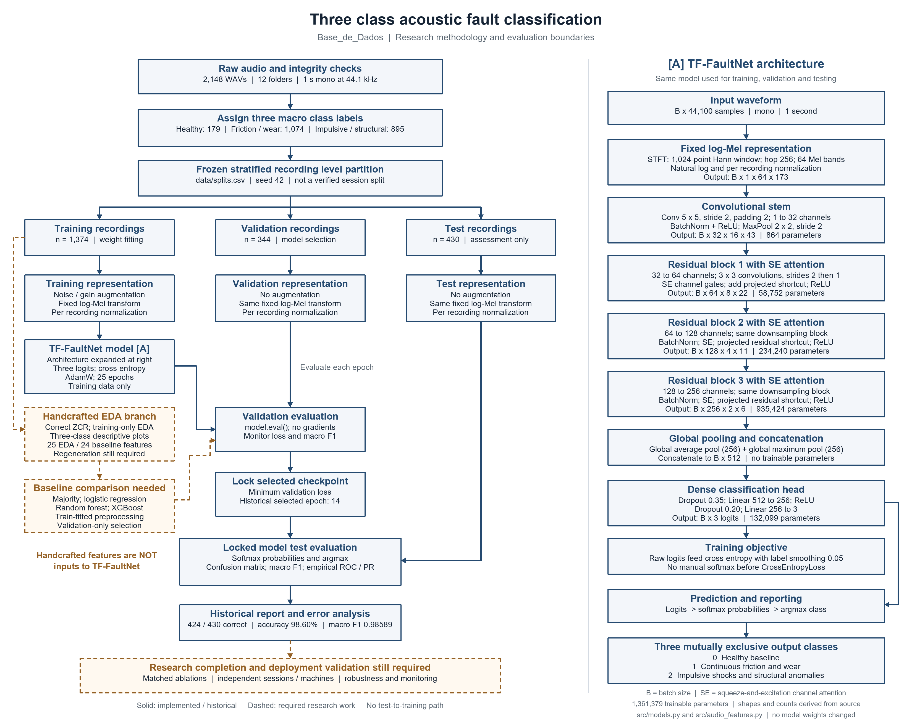

# Research methodology for three class acoustic fault classification

Project: Base_de_Dados · Model: TF-FaultNet · Status reviewed: 9 September 2026

## 1 Purpose and research design

This study investigates whether a time–frequency convolutional neural network can classify a one-second machine-sound recording into three mutually exclusive operating-condition groups: healthy baseline, continuous friction and wear, or impulsive shocks and structural anomalies. The existing project uses all 12 source folders, but assigns their recordings to three macro classes. It does not concatenate the recordings into a single long signal, and it does not train the selected model to predict 12 classes.

The research uses supervised multiclass classification. Each WAV recording is one observational unit. The input is a mono waveform containing 44,100 samples; the target is one integer label, 0, 1, or 2. The network returns three logits, which are converted to softmax probabilities for reporting; the highest-probability class is the prediction. Macro F1 is the primary reporting metric because the macro classes are imbalanced. Accuracy, macro precision, macro recall, per-class results, ROC AUC, and average precision are secondary measures. Validation loss, rather than macro F1, is the implemented checkpoint-selection criterion.

The intended research question is whether learned time–frequency representations improve three-class discrimination over simpler predictors under the same evaluation protocol. The current saved CNN result is evidence of performance on the existing file-level partition, not proof of superiority over baselines or generalization to unseen machines. Matched corrected-feature baseline experiments and independent-session validation are still required.

This document separates **implemented methods and historical observations** from **research work still required**. It does not present a recommended experiment as an experiment already completed. Source identifiers in brackets refer to the repository evidence index in Section 12.

## 2 Dataset and target construction

The local dataset contains 2,148 WAV recordings distributed equally across 12 original folders, with 179 recordings per folder. The read-only audio audit found readable, mono, 16-bit PCM files at 44.1 kHz, each containing 44,100 samples, equivalent to one second. The project describes these recordings as belt-drive machine sounds; acquisition conditions and independence between recording sessions need stronger source documentation. [S1–S3]

| Target | Macro class | Original folder membership | Recordings | Share |
|---|---|---|---:|---:|
| 0 | Healthy baseline | Normal | 179 | 8.33% |
| 1 | Continuous friction and wear | Escorregamento; Escorregamento_P1; Escorregamento_P1P4; Perda_material; Perda_material_P1; Perda_material_P1P4 | 1,074 | 50.00% |
| 2 | Impulsive shocks and structural anomalies | Perda_concentrada; Perda_concentrada_P1; Perda_concentrada_P1P4; Sem_P1; Sem_P1P4 | 895 | 41.67% |

The macro taxonomy is a project-defined grouping, not a new ground-truth measurement. Its mechanical interpretation should be justified using dataset documentation or domain expertise. The suffixes and folder names alone do not establish recording-session IDs. Original folder names must remain in metadata so within-class error patterns can be inspected later. Raw WAV files remain unchanged.

## 3 Data integrity and partitioning

The current training entry point reads the frozen `data/splits.csv` manifest using `split_multiclass_3class`. The partition follows the historical stratified split with seed 42 and approximately 64% training, 16% validation, and 20% test data. It is a recording-level split, not a verified participant-, session-, or machine-level split. [S2, S4]

| Partition | Healthy | Friction and wear | Impulsive and structural | Total | Permitted role |
|---|---:|---:|---:|---:|---|
| Training | 114 | 687 | 573 | 1,374 | Learn weights and fit any learned preprocessing |
| Validation | 29 | 172 | 143 | 344 | Select checkpoints and development choices |
| Test | 36 | 215 | 179 | 430 | Evaluate a locked model; never select it |
| Total | 179 | 1,074 | 895 | 2,148 | Complete three-class dataset |

Manifest checks reject repeated paths, invalid labels or partitions, missing files, and missing classes in a partition. The earlier read-only content audit found no exact duplicate PCM recordings, and the saved test archive matched its original WAV recordings. These are useful integrity checks, but they do not rule out near-duplicates, overlapping acquisitions, or common-session background cues. All 12 original folders occur across the partitions; folder separation is therefore not the evaluation design.

The current script preloads all waveforms and computes fixed test spectrograms before optimization. This computation does not fit a transform on the test population, but it also means that “zero exposure” is not a literal description of data handling. Scientifically defensible wording is “a disjoint file-level held-out partition with no intended test-based parameter fitting.” Broader “zero leakage” claims require verified acquisition groups and a stronger audit.

The historical checkpoint predates the recent manifest-loading repair and has not been retrained by that repair. The new guardrails improve future execution; they do not retroactively provide a complete provenance record for the old run.

## 4 Exploratory data analysis and cleaning

EDA serves to understand the signal distribution, identify invalid measurements, assess class imbalance, and motivate representations and baselines. It is not an additional input branch of the CNN. The existing EDA script analyzes the 12 original folders and extracts 25 time- and frequency-domain descriptors. These include amplitude and energy measures, distribution shape, zero-crossing rate, spectral statistics, and six frequency-band energy ratios. It produces waveform and spectral examples, descriptor-distribution plots, and PCA and t-SNE projections. [S3, S5]

For a research-ready three-class analysis, descriptive plots should show the three macro classes, with the 12 original conditions retained as a supplementary breakdown. Any exploratory decisions that can influence model design should use development data, preferably training data. Learned scaling and PCA must be fitted on training data only; t-SNE is a descriptive visualization, not evidence of classifier accuracy or independent generalization.

The existing EDA implementation standardizes features across the complete dataset before its projections and is not manifest-aware. This is a limitation of the historical exploratory analysis. It does not directly fit the CNN's normalization, because the CNN uses a separate per-recording spectrogram transformation. Nevertheless, test-informed exploration can influence human model choices, so the historical test set cannot now be described as never inspected.

### Zero crossing rate correction

The old implementation measured changes between zero and nonzero amplitudes rather than negative-to-positive sign changes. The corrected shared function counts transitions between negative and nonnegative adjacent samples and divides by the number of adjacent sample pairs. Both signed zeros are treated as nonnegative. It rejects invalid, non-finite, or non-mono inputs and leaves the waveform unchanged. [S6]

The correction preserves feature order and dimension: the EDA vector has 25 features and the classical-model vector has 24. Their zero-crossing-rate positions are 12 and 13 respectively, using zero-based indexing. Historical ZCR summaries, PCA, and t-SNE outputs derived from the old vector must be regenerated. Classical models trained with the old feature definition must be retrained on corrected training features before any valid comparison. The waveform CNN does not consume this descriptor, so the bug fix itself does not change its learned weights or predictions.

No recordings should be discarded because they are hard to classify or lower a score. Invalid-file handling, clipping or silence checks, and any justified exclusions must be documented. Low adjacent-waveform correlation is not enough to establish independent recording sessions. Near-duplicate detection and acquisition-group identification remain required research checks.

## 5 Signal transformation and augmentation

The audio loader converts WAV samples into floating-point waveforms and pads or trims them to 44,100 samples when necessary. The audited dataset already has the expected length and sample rate. Training augmentation independently applies additive Gaussian noise with probability 0.35 and standard deviation 0.003, and amplitude gain with probability 0.35 drawn uniformly from 0.85 to 1.15. Validation and test data receive no augmentation. [S4, S7]

The CNN input transformation follows these fixed operations:

1. Compute the short-time Fourier transform with a 1,024-sample Hann window and 256-sample hop. The implementation uses centered frames and reflect padding.
2. Square the complex magnitude to obtain a power spectrogram.
3. Project power into 64 fixed, energy-normalized triangular Mel filters spanning 20 Hz to 22,050 Hz.
4. Clamp Mel power at a minimum of 0.000001 and apply the natural logarithm. Despite a source comment mentioning dB, the implemented transform is natural log, not a decibel conversion.
5. Normalize each individual log-Mel spectrogram using its own mean and standard deviation across time and frequency, with a small denominator offset.
6. Add the channel dimension to produce a tensor shaped `(B, 1, 64, 173)`, where B is batch size.

The Hann window and Mel filters are fixed buffers, not learned filters. Per-recording normalization uses no population statistics fitted on validation or test recordings. This representation provides a two-dimensional time–frequency structure suited to local convolutional processing. That structural match motivates a CNN candidate, but does not establish that it outperforms simpler models.

## 6 Proposed classifier and learning mechanism

TF-FaultNet is trained from scratch with `num_classes=3`. It consists of an initial convolution and pooling stage, three residual blocks with squeeze-and-excitation channel attention, combined global average and maximum pooling, and a dense classification head. Convolutions learn local spectrotemporal patterns; residual paths provide additive shortcuts; channel attention reweights intermediate feature maps. The usefulness of each component must be tested rather than assumed. [S8]

| Stage | Main operation | Output per batch | Trainable parameters |
|---|---|---|---:|
| Input transform | Fixed STFT, Mel projection, natural log and per-sample normalization | B × 1 × 64 × 173 | 0 |
| Stem | 5 × 5 convolution, stride 2, padding 2; BatchNorm; ReLU; 2 × 2 max pooling, stride 2 | B × 32 × 16 × 43 | 864 |
| Residual block 1 | 32 to 64 channels; two 3 × 3 convolutions; downsampling stride 2; SE; projected shortcut | B × 64 × 8 × 22 | 58,752 |
| Residual block 2 | 64 to 128 channels; same block structure | B × 128 × 4 × 11 | 234,240 |
| Residual block 3 | 128 to 256 channels; same block structure | B × 256 × 2 × 6 | 935,424 |
| Global pooling | Average and maximum pooling concatenated | B × 512 | 0 |
| Classifier | Dropout 0.35; dense 512 to 256; ReLU; dropout 0.20; dense 256 to 3 | B × 3 logits | 132,099 |
| Total | Analytical count from source; includes trainable BatchNorm scale and offset | Three-class prediction | 1,361,379 |

Each residual block uses padding 1 for its 3 × 3 convolutions; the second convolution has stride 1. Its shortcut uses a 1 × 1 stride-2 projection with BatchNorm. The SE bottleneck width is one eighth of the block channel count. Its sigmoid gates are internal attention weights, not class probabilities. BatchNorm running statistics are non-trainable state and are excluded from the parameter count. Tensor shapes and counts above are derived from source, not a newly executed PyTorch model summary.

## 7 Optimization and checkpoint selection

Training minimizes `CrossEntropyLoss` with label smoothing of 0.05, using three raw output logits and integer targets. Softmax is applied for prediction reporting, not manually before this loss. The optimizer is AdamW with initial learning rate 0.001 and weight decay 0.0001. The batch size is 64 and the configured training duration is 25 epochs. `CosineAnnealingLR` decreases the learning rate over 25 epochs toward 0.00001. NumPy and PyTorch seeds are set to 42. Full hardware-level determinism is not guaranteed by seed setting alone. [S4, S9]

Each training batch performs a forward pass, computes the loss, clears gradients, backpropagates the loss, and updates parameters. Validation runs with evaluation mode and disabled gradients. Dropout is disabled and BatchNorm uses its evaluation behavior during validation and testing. Only the checkpoint with the lowest validation loss is retained as the selected model. The implementation completes the configured epochs; best-checkpoint selection is not the same as stopping training early.

The saved history selects epoch 14, with validation loss approximately 0.19915, validation accuracy 98.84%, and validation macro F1 0.99147. Training accuracy was 100% at that epoch. By epoch 25, validation loss increased to approximately 0.20357 and validation accuracy fell to 98.26%, while training accuracy remained 100%. This is consistent with mild late-stage overfitting on this split. It is not enough to conclude that the model only memorizes, nor does it rule out recording-condition shortcuts. [S10]

Training loss includes augmentation, dropout, and label smoothing. Validation loss uses no augmentation or dropout, but the same criterion. Therefore, curve gaps should be interpreted with these differences in mind. Do not reshape or smooth training curves in a way that hides the recorded epoch values.

## 8 Baselines and controlled comparisons

The research design should establish a training-majority classifier and a simple learned baseline before claiming that the CNN's complexity is justified. The repository contains three-class baseline code for logistic regression, random forest, and XGBoost using 24 handcrafted descriptors. These inputs are not supplied to TF-FaultNet. The baseline script is evidence of an implementation path, not evidence that corrected-feature comparisons have been completed. [S11]

For the next valid comparison, extract corrected features using the frozen training partition; fit imputation or scaling, if required, only on training features; tune each candidate using validation data; and lock the comparison protocol before final assessment. Logistic regression particularly needs a train-fitted scaling pipeline for these differently scaled descriptors. The current baseline script should not be used as a test-driven model selector: evaluating candidate models on test data and then selecting the apparent winner invalidates the claimed final-test role.

Use the same class mapping, partitions, metrics, and reporting conventions for all compared models. Predefine ablations for SE attention, residual connections, augmentation, and the combined pooling head if improvements are attributed to these components. Repeat development experiments with recorded seeds and report variability. No completed, matched three-class ablation study is established by the inspected artifacts. Older 12-class benchmark figures should not be presented as three-class evidence.

## 9 Evaluation and interpretation of the historical result

After checkpoint selection, the evaluator loads the selected model, switches to evaluation mode, disables gradients, and computes softmax probabilities and argmax predictions for the 430 test recordings. The historical report contains the following confusion matrix, with rows representing actual classes and columns predicted classes. [S12]

| Actual class | Predicted healthy | Predicted friction and wear | Predicted impulsive and structural |
|---|---:|---:|---:|
| Healthy | 35 | 0 | 1 |
| Friction and wear | 0 | 210 | 5 |
| Impulsive and structural | 0 | 0 | 179 |

The matrix contains 424 correct predictions and six errors. Reported accuracy is 98.6047%; macro precision is 0.98919; macro recall is 0.98299; and macro F1 is 0.98589. The reported macro ROC AUC is 0.99954 and micro ROC AUC is 0.99880. The report's PR summary corresponds to average precision, with macro AP approximately 0.99937; it should not be conflated with every possible numerical definition of area under a PR curve.

For three classes, construct one-versus-rest ROC curves using each class's continuous probability score, not its final hard label. Report empirical class curves and their AUC values. Explain whether macro AUC means the area under an interpolated mean ROC or the arithmetic mean of class AUCs; the existing report uses the former. Near-perfect ranking can legitimately produce curves close to the top-left corner. Do not fabricate curvature or reduce performance to imitate a textbook figure. Any interpolated display must remain distinguishable from the empirical observations and must not change the scientific metric.

The test set has already been evaluated and inspected, including subsequent plot reproduction. It cannot now be portrayed as a new, untouched final evaluation. Preserve the existing report as a historical result and avoid using it to guide further architecture or hyperparameter changes. To support stronger generalization claims after further development, obtain a genuinely independent, prospectively locked session- or machine-level assessment set. Do not silently regenerate the frozen split to obtain more favorable results.

Report class-level uncertainty, acquisition-group-aware uncertainty when groups are available, and representative errors by original folder. Current high scores do not establish robustness to a different microphone, machine, speed, load, or acoustic environment. Sensitivity and precision depend on the chosen three-class taxonomy; they do not measure discrimination between every original fault subtype.

## 10 Research flowchart

**Figure 1.** Repository-grounded workflow for the three-class study. Solid boxes show the implemented CNN path and its historical evaluation. Dashed boxes identify baseline or external-validation work still required. The test branch enters only locked-model assessment, never the weight-fitting or selection path. The figure expresses the intended evaluation boundary; Section 3 explains that the current script also precomputes fixed test representations, and Section 9 explains that the historical test data have already been inspected.

The handcrafted branch has no arrow into the CNN. Its purpose is interpretation and classical-model comparison. The CNN instead learns its own features from spectrograms through gradient-based optimization. Panel A expands TF-FaultNet into its fixed log-Mel transform, convolutional stem, three residual SE blocks, combined pooling, dense head, and three-class prediction. It separates the cross-entropy training objective from the softmax and argmax reporting path; loss is not an input to softmax. Layer shapes and parameter counts are derived from the source code.

## 11 Limitations reproducibility and completion criteria

The most important limitation is unknown acquisition grouping. A random file-level split may contain similar recordings from the same operating setup on both sides. Exact-duplicate absence does not resolve this. The class taxonomy, small healthy test support of 36 recordings, and absence of independent deployment data also constrain the conclusions.

Preserve the frozen manifest, raw-data hashes, label mapping, source revision, package versions, seeds, hyperparameters, full history, selected epoch, checkpoint hash, and per-recording predictions with source IDs. Save a run-specific configuration alongside each checkpoint. The current configuration JSON records the intended settings, but the training script still hardcodes its settings rather than reading that file. A weights-only checkpoint alone is not a complete reproducibility package.

The recent repair passed 14 focused tests covering the ZCR helper, isolated descriptor-function behavior, and manifest validation. Full PyTorch import integration was blocked by Windows Application Control for `c10.dll`, so this documentation task does not claim a new end-to-end training run or regenerated EDA results. Exported checkpoint, TorchScript, and ONNX assets exist; the ONNX backbone expects spectrograms, while the full waveform model includes the transform. Their existence is not a completed deployment or monitoring study.

Before presenting the project as a completed thesis evaluation:

1. Verify acquisition provenance and justify the three-class mapping with domain evidence.
2. Regenerate corrected, development-only EDA with three-class labels and original-folder supplementary plots.
3. Complete train-fitted, validation-selected baseline comparisons and controlled component ablations.
4. Bind each experiment to configuration, code, manifest and checkpoint hashes; record repeated-seed variability.
5. Lock the model and protocol before any new independent test, and report errors and uncertainty without test-driven retuning.
6. Validate robustness and inference preprocessing before deployment; monitor input drift and failure modes using a separately defined operational protocol.

Dataset licensing, acquisition permission, and redistribution rights are not established by the code and should be documented. Machine audio may incidentally capture speech or site-specific information. Inspect for privacy-sensitive content and do not assume that a machine-sound dataset is automatically free of privacy risks. Automated predictions should not replace safety-critical maintenance inspection without a validated operating procedure.

## 12 Repository evidence index

The methodology is based on local code and saved artifacts, not an external literature review. File names below are relative to the project root. Historical artifact contents are treated as observations, not as authoritative proof of claims such as “zero leakage.”

| ID | Evidence | Methodology role |
|---|---|---|
| S1 | `metadata/class_mapping_3class.json` | Exact folder-to-target mapping |
| S2 | `data/splits.csv`; `src/split_manifest.py` | Frozen partition membership and validation rules |
| S3 | `docs/PROBLEM_SPECIFICATION.md`; `docs/EDA_PREPROCESSING.md` | Problem context, audit record and repair caveats |
| S4 | `train_3class_pipeline.py` | Three-class orchestration and checkpoint selection |
| S5 | `eda_analysis.py` | Historical 25-feature EDA and projection workflow |
| S6 | `src/signal_statistics.py`; `tests/test_signal_statistics.py`; `tests/test_zcr_extractors.py` | Corrected ZCR and focused regression coverage |
| S7 | `src/dataset.py`; `src/audio_features.py` | Waveform handling, augmentation and fixed log-Mel transform |
| S8 | `src/models.py` | TF-FaultNet layers, shapes and analytical parameter counts |
| S9 | `train.py`; `configs/experiment_3class.json` | Epoch routines and documented training settings |
| S10 | `results/training_convergence_history_3class.csv` | Recorded training and validation behavior |
| S11 | `scripts/baseline_comparison_3class.py` | Handcrafted-feature candidate baseline implementation |
| S12 | `evaluate_3class_test_set.py`; `results/heldout_test_evaluation_report_3class.json` | Evaluator and historical three-class metrics |

### Suggested thesis summary

This work formulates acoustic condition recognition as a three-class supervised classification problem using 2,148 one-second recordings from the Base_de_Dados dataset. Twelve source conditions are mapped to three macro categories while retaining the original condition metadata. A frozen stratified file-level partition provides 1,374 training, 344 validation, and 430 test recordings. Waveforms are transformed into per-recording-normalized log-Mel spectrograms and processed by TF-FaultNet, a residual convolutional model with channel attention and combined global pooling. Training uses AdamW, label-smoothed cross-entropy, training-only signal augmentation, and minimum-validation-loss checkpoint selection. The historical test report records 98.60% accuracy and 0.98589 macro F1. These results describe the existing file-level partition; corrected EDA, matched baselines, ablations, and independent acquisition-level validation remain necessary before claiming comparative superiority or deployment generalization.
